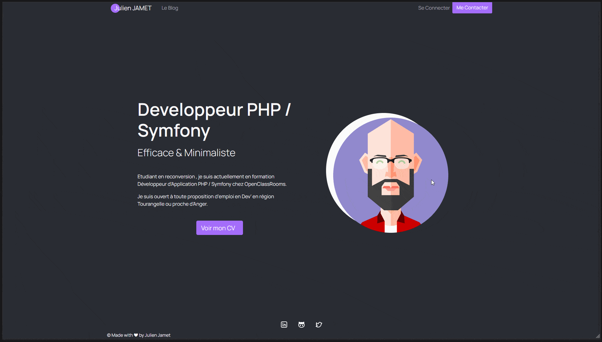

# Blog_PHP  [](https://www.codacy.com/gh/leCheveuCodeur/Blog_PHP/dashboard?utm_source=github.com&utm_medium=referral&utm_content=leCheveuCodeur/Blog_PHP&utm_campaign=Badge_Grade) [](https://scrutinizer-ci.com/g/leCheveuCodeur/Blog_PHP/?branch=main) [](https://codeclimate.com/github/leCheveuCodeur/Blog_PHP/maintainability)

## Description

This project is the 5th project of the [Developer PHP / Symfony](https://openclassrooms.com/fr/paths/59-developpeur-dapplication-php-symfony) formation of [Openclassrooms](https://openclassrooms.com/).

The goal of this project is to create a professional blog with the [PHP](https://www.php.net/manual/en/intro-whatis.php) language without any frameworks.

## How it work



## Build with

* [PHP 7.4.19](https://www.php.net/releases/index.php)
* [Apache 2.4.48](https://www.apachelounge.com/download/VC15/)
* [MySQL 8.0.24](https://downloads.mysql.com/archives/installer/)
* [Bootstrap v5.0.2](https://getbootstrap.com/)
* [PHPMailer 6.5.0](https://packagist.org/packages/phpmailer/phpmailer)
* [Composer](https://getcomposer.org/download/)
* **Server** : *for the server you can turn to the classics: [WAMP](https://www.wampserver.com/), [MAMP](https://www.mamp.info/en/downloads/), [XAMPP](https://www.apachefriends.org/fr/index.html) ...
  Or test the best of the swiss knives server: [Laragon](https://laragon.org/), my favorite ❤️*

## Installation

* **Clone or download the repository**, and put files into your environment,

  ```
  git clone https://github.com/leCheveuCodeur/Blog_PHP.git
  ```
* Install libraries with **composer**,

  ```
  composer.phar install
  ```
* Import database with datas : file '***database.sql***',
* Rename '***config_example.php***' in folder **/config** on '***config.php***' and edit this,
* And connect you !

  ```
  Pseudo : Admin
  Password : admin
  ```
